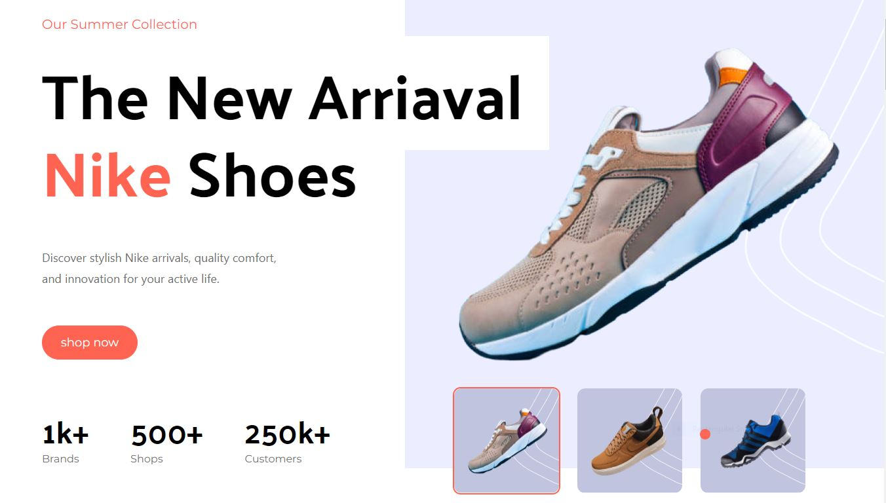

# Nike Website Clone

Welcome to the Nike Website project! This project is a showcase of modern web development techniques, utilizing Vite React, Tailwind CSS, Framer Motion, and GSAP for smooth animations and interactions.

## Preview



## Features

- **Vite-React**: Utilizes Vite for fast, modern React development.
- **Tailwind CSS**: Employs Tailwind CSS for rapid UI development and styling.
- **Framer Motion**: Implements Framer Motion for fluid animations and interactive elements.
- **GSAP**: Integrates GSAP for creating custom animations, including a unique following cursor effect.
- **Preloader**: Features a sleek preloader animation built with Framer Motion to enhance user experience.

## Live Demo

[Check out the live demo here!](https://nike-clone-burninghat.vercel.app/)

## Installation

1. Clone the repository:

```bash
git clone https://github.com/BurningHat20/Nike-Clone.git
```

2. Navigate into the project directory:

```bash
cd Nike-Clone
```

3. Install dependencies:

```bash
npm install
```

4. Start the development server:

```bash
npm run dev
```

5. Open your browser and visit `http://localhost:5173` to view the website.

## File Structure

```
nike-website/
│
├── public/
│   ├── index.html
│   └── ...
│
├── src/
│   ├── components/
│   │   ├── Header.js
│   │   ├── Footer.js
│   │   └── ...
│   ├── pages/
│   │   ├── Home.js
│   │   ├── About.js
│   │   └── ...
│   ├── styles/
│   │   ├── index.css
│   │   └── ...
│   ├── App.js
│   ├── index.js
│   └── ...
│
├── README.md
├── LICENSE
└── ...
```

## Usage

Feel free to explore the codebase and customize it to your liking! Here are a few pointers to get started:

- **Animations**: Discover how Framer Motion and GSAP are utilized for animating various elements throughout the website.
- **Cursor Effect**: Dive into the GSAP implementation for the custom following cursor effect, adding a unique touch to user interactions.
- **Styling**: Leverage Tailwind CSS classes and utility-first approach for styling components and layouts efficiently.
- **Preloader**: Examine the preloader animation created with Framer Motion, enhancing the loading experience for users.

## Contributing

Contributions are welcome! If you'd like to contribute to this project, please follow these steps:

1. Fork the repository.
2. Create your feature branch: `git checkout -b feature/new-feature`.
3. Commit your changes: `git commit -m 'Add some feature'`.
4. Push to the branch: `git push origin feature/new-feature`.
5. Submit a pull request.

## License

This project is licensed under the [MIT License](LICENSE).

## Acknowledgements

- **Vite**: Fast, opinionated web dev build tool that serves your code via native ES Module imports during development.
- **Tailwind CSS**: A utility-first CSS framework for rapid UI development.
- **Framer Motion**: A production-ready motion library for React providing a simple interface for creating animations.
- **GSAP**: A JavaScript library for creating high-performance, zero dependencies, cross-browser animations.

## Social Links

Connect with us on social media:

- [Portfolio](https://burninghat.tech)
- [Twitter](https://twitter.com/yashgohel_)
- [Instagram](https://instagram.com/yashdgaf._)
- [LinkedIn](https://www.linkedin.com/in/yashgohel777/)
